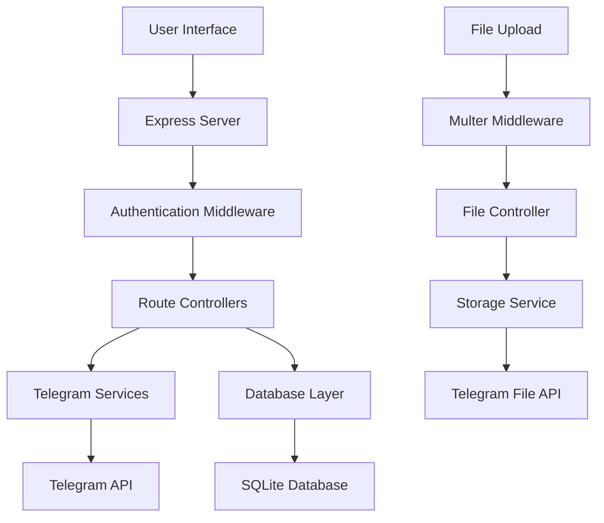

# ☁️ CloudVault - Advanced Telegram Storage Platform

<div align="center">


**Transform your Telegram account into a powerful cloud storage platform with multiple storage methods, file organization, and advanced management features.**

[](https://render.com/deploy?repo=https://github.com/Souvik65/cloudvault-telegram-storage)


[🚀 Live Demo](#-live-demo) • [📖 Documentation](#-documentation) • [🛠️ Installation](#️-installation) • [🤝 Contributing](#-contributing)

</div>

---

## 📋 Table of Contents

- [✨ Features](#-features)
- [🎯 Key Highlights](#-key-highlights)
- [🚀 Live Demo](#-live-demo)
- [📸 Screenshots](#-screenshots)
- [🛠️ Installation](#️-installation)
- [⚙️ Configuration](#️-configuration)
- [🚀 Deployment](#-deployment)
- [📖 API Documentation](#-api-documentation)
- [🔧 Usage Examples](#-usage-examples)
- [🏗️ Architecture](#️-architecture)
- [🤝 Contributing](#-contributing)
- [📄 License](#-license)
- [👨‍💻 Author](#-author)

---

## ✨ Features

### 🔐 **Secure Authentication**
- **Phone + OTP verification** via Telegram API
- **Two-Factor Authentication (2FA)** support
- **JWT-based session management**
- **Auto-logout on token expiration**

### 📁 **Multiple Storage Methods**
- **💾 Saved Messages** - Default and most reliable
- **📢 Private Channels** - Organized storage with auto-creation
- **👥 Private Groups** - Collaborative storage
- **🤖 Bot Storage** - Automated file management

### 🗂️ **Advanced File Management**
- **Folder organization** with nested structure
- **File preview** for images, PDFs, videos, audio
- **Bulk operations** (upload, download, delete)
- **Search functionality** with filters
- **File migration** between storage methods

### 🎨 **Modern User Interface**
- **Responsive design** for all devices
- **Drag & drop upload** support
- **Real-time progress indicators**
- **Dark/Light theme** compatible
- **Intuitive navigation** with breadcrumbs

### 📊 **Analytics & Monitoring**
- **Storage statistics** by method and file type
- **Usage analytics** and file breakdown
- **Health monitoring** endpoints
- **Performance metrics** tracking

---

## 🎯 Key Highlights

| Feature | Description | Status |
|---------|-------------|--------|
| **Unlimited Storage** | Leverage Telegram's 2GB per file limit | ✅ Active |
| **Multi-Device Sync** | Access files from any device | ✅ Active |
| **Zero Data Loss** | Files stored in your Telegram account | ✅ Active |
| **Privacy First** | No third-party storage, complete control | ✅ Active |
| **Auto-Backup** | Telegram's built-in redundancy | ✅ Active |
| **Global CDN** | Telegram's worldwide infrastructure | ✅ Active |

---

## 🚀 Live Demo

### 🌐 **Try CloudVault Now**

**Demo URL:** [https://cloudvault-storage.onrender.com](https://cloudvault-storage.onrender.com)

**Test Credentials:**
- Use your own Telegram phone number
- No registration required - just login with Telegram

**Demo Features:**
- ✅ Full file upload/download functionality
- ✅ All storage methods available
- ✅ Real-time file management
- ✅ Complete folder organization

---

## 📸 Screenshots

<div align="center">

### 🔐 **Secure Login**


### 📁 **File Management**


### ⚙️ **Storage Settings**


### 📊 **Analytics Dashboard**


</div>

---

## 🛠️ Installation

### 📋 **Prerequisites**

- **Node.js** 18+ ([Download](https://nodejs.org/))
- **npm** 8+ (comes with Node.js)
- **Telegram Account** (for API credentials)
- **Git** ([Download](https://git-scm.com/))

### 🚀 **Quick Start**

```bash
# 1. Clone the repository
git clone https://github.com/Souvik65/cloudvault-telegram-storage.git
cd cloudvault-telegram-storage

# 2. Install backend dependencies
cd backend
npm install

# 3. Set up environment variables
cp .env.example .env
# Edit .env with your Telegram API credentials

# 4. Start the development server
npm run dev

# 5. Open your browser
# Navigate to http://localhost:3001
```

### 🔑 **Get Telegram API Credentials**

1. Visit [my.telegram.org](https://my.telegram.org)
2. Log in with your phone number
3. Go to **"API Development Tools"**
4. Create a new application:
   ```
   App title: CloudVault Storage
   Short name: cloudvault
   Platform: Server
   Description: Personal cloud storage platform
   ```
5. Copy your **API ID** and **API Hash**

---

## ⚙️ Configuration

### 🔧 **Environment Variables**

Create a `.env` file in the `backend` directory:

```env
# Telegram API Configuration (Required)
TELEGRAM_API_ID=your_api_id_here
TELEGRAM_API_HASH=your_api_hash_here

# Server Configuration
PORT=3001
NODE_ENV=development

# Security Configuration
JWT_SECRET=your-super-secret-jwt-key-min-32-chars
JWT_EXPIRES_IN=7d

# Database Configuration
DB_PATH=./data/cloudvault.db

# CORS Configuration
FRONTEND_URL=http://localhost:3000
```

### 📊 **Database Setup**

CloudVault uses SQLite for lightweight, serverless database management:

```bash
# Database is automatically created on first run
# Location: backend/data/cloudvault.db

# To reset database (development only)
rm backend/data/cloudvault.db
npm start
```

---

## 🚀 Deployment

### 🌐 **Deploy to Render (Recommended)**

[](https://render.com/deploy?repo=https://github.com/Souvik65/cloudvault-telegram-storage)

**One-Click Deployment:**

1. Click the "Deploy to Render" button above
2. Connect your GitHub account
3. Set environment variables:
   ```
   TELEGRAM_API_ID=your_api_id
   TELEGRAM_API_HASH=your_api_hash
   JWT_SECRET=random-secret-key
   NODE_ENV=production
   ```
4. Deploy! 🚀

**Manual Deployment:**

```bash
# 1. Create Render account at render.com
# 2. Create new Web Service
# 3. Connect GitHub repository
# 4. Configure:
Build Command: npm run build
Start Command: npm start
Environment: Node

# 5. Add persistent disk for database:
Mount Path: /opt/render/project/src/backend/data
Size: 1GB (free tier)
```

### 🐳 **Deploy with Docker**

```dockerfile
# Dockerfile (coming soon)
FROM node:18-alpine
WORKDIR /app
COPY . .
RUN npm install --production
EXPOSE 3001
CMD ["npm", "start"]
```

### ☁️ **Other Deployment Options**

| Platform | Difficulty | Free Tier | Guide |
|----------|------------|-----------|-------|
| **Render** | ⭐ Easy | ✅ 750hrs/month | [Guide](#-deploy-to-render-recommended) |
| **Railway** | ⭐ Easy | ✅ $5 credit | [Railway Guide](https://railway.app) |
| **Heroku** | ⭐⭐ Medium | ❌ Paid only | [Heroku Guide](https://heroku.com) |
| **Vercel** | ⭐⭐ Medium | ✅ Hobby plan | [Vercel Guide](https://vercel.com) |
| **DigitalOcean** | ⭐⭐⭐ Hard | ❌ $5/month | [DO Guide](https://digitalocean.com) |

---

## 📖 API Documentation

### 🔐 **Authentication Endpoints**

```http
POST /api/auth/send-code
Content-Type: application/json

{
  "phoneNumber": "+1234567890"
}
```

```http
POST /api/auth/verify-code
Content-Type: application/json

{
  "phoneNumber": "+1234567890",
  "code": "12345"
}
```

### 📁 **File Management Endpoints**

```http
GET /api/files
Authorization: Bearer <token>

# Response
{
  "success": true,
  "files": [...],
  "folders": [...]
}
```

```http
POST /api/files/upload
Authorization: Bearer <token>
Content-Type: multipart/form-data

file: <file>
description: "My document"
folderPath: "documents/work"
```

### ⚙️ **Storage Management Endpoints**

```http
GET /api/storage/options
Authorization: Bearer <token>

# Response
{
  "success": true,
  "options": {
    "savedMessages": {...},
    "channels": [...],
    "groups": [...],
    "bots": [...]
  }
}
```

### 📊 **Health & Monitoring**

```http
GET /health

# Response
{
  "status": "OK",
  "timestamp": "2025-07-01T11:18:33.000Z",
  "server": {
    "uptime": 3600,
    "memory": "45MB",
    "platform": "linux"
  }
}
```

---

## 🔧 Usage Examples

### 📤 **Upload Files Programmatically**

```javascript
// Upload file with JavaScript
const formData = new FormData();
formData.append('file', fileInput.files[0]);
formData.append('description', 'My document');
formData.append('folderPath', 'documents');

const response = await fetch('/api/files/upload', {
  method: 'POST',
  headers: {
    'Authorization': `Bearer ${token}`
  },
  body: formData
});

const result = await response.json();
console.log('Upload result:', result);
```

### 🔍 **Search Files**

```javascript
// Search files with filters
const searchFiles = async (query, filters = {}) => {
  const params = new URLSearchParams({
    q: query,
    ...filters
  });
  
  const response = await fetch(`/api/files/search?${params}`, {
    headers: {
      'Authorization': `Bearer ${token}`
    }
  });
  
  return await response.json();
};

// Usage
const results = await searchFiles('presentation', {
  type: 'application/pdf',
  storage: 'private_channel'
});
```

### 🔄 **Migrate Files**

```javascript
// Migrate files between storage methods
const migrateFiles = async (fileIds, newStorageConfig) => {
  const response = await fetch('/api/storage/migrate', {
    method: 'POST',
    headers: {
      'Content-Type': 'application/json',
      'Authorization': `Bearer ${token}`
    },
    body: JSON.stringify({
      fileIds,
      newStorageConfig
    })
  });
  
  return await response.json();
};
```

---

## 🏗️ Architecture

### 📁 **Project Structure**

```
cloudvault-telegram-storage/
├── 📂 backend/
│   ├── 📂 src/
│   │   ├── 📂 config/          # Database & app configuration
│   │   ├── 📂 controllers/     # Route handlers
│   │   ├── 📂 middleware/      # Express middleware
│   │   ├── 📂 routes/          # API routes
│   │   ├── 📂 services/        # Business logic & Telegram API
│   │   ├── 📂 utils/           # Utility functions
│   │   └── 📄 app.js           # Express application
│   ├── 📂 data/                # SQLite database
│   └── 📄 package.json
├── 📂 frontend/
│   └── 📄 index.html           # Single-page application
├── 📄 package.json             # Root package.json
├── 📄 README.md
└── 📄 .env.example
```

### 🔄 **Data Flow**



### 🗄️ **Database Schema**

```sql
-- Users table
CREATE TABLE users (
    id INTEGER PRIMARY KEY AUTOINCREMENT,
    telegram_id TEXT UNIQUE NOT NULL,
    phone_number TEXT NOT NULL,
    session_string TEXT NOT NULL,
    storage_preference TEXT DEFAULT 'saved_messages',
    storage_config TEXT DEFAULT '{}',
    created_at DATETIME DEFAULT CURRENT_TIMESTAMP
);

-- Files table
CREATE TABLE files (
    id INTEGER PRIMARY KEY AUTOINCREMENT,
    user_id INTEGER NOT NULL,
    file_name TEXT NOT NULL,
    file_type TEXT,
    file_size INTEGER,
    telegram_message_id TEXT NOT NULL,
    telegram_chat_id TEXT DEFAULT 'me',
    storage_method TEXT DEFAULT 'saved_messages',
    folder_path TEXT DEFAULT '',
    description TEXT DEFAULT '',
    created_at DATETIME DEFAULT CURRENT_TIMESTAMP,
    FOREIGN KEY (user_id) REFERENCES users (id)
);

-- Folders table
CREATE TABLE folders (
    id INTEGER PRIMARY KEY AUTOINCREMENT,
    user_id INTEGER NOT NULL,
    folder_name TEXT NOT NULL,
    folder_path TEXT DEFAULT '',
    created_at DATETIME DEFAULT CURRENT_TIMESTAMP,
    FOREIGN KEY (user_id) REFERENCES users (id)
);
```

---

## 🤝 Contributing

We welcome contributions from the community! Here's how you can help:

### 🐛 **Bug Reports**

Found a bug? Please create an issue with:

- **Clear description** of the problem
- **Steps to reproduce** the issue
- **Expected vs actual behavior**
- **Environment details** (OS, Node.js version, etc.)

### ✨ **Feature Requests**

Have an idea? We'd love to hear it:

- **Describe the feature** and its benefits
- **Explain the use case** and why it's needed
- **Provide mockups** or examples if possible

### 🔧 **Pull Requests**

Ready to contribute code?

```bash
# 1. Fork the repository
# 2. Create a feature branch
git checkout -b feature/amazing-feature

# 3. Make your changes
# 4. Test thoroughly
npm test

# 5. Commit with conventional commits
git commit -m "feat: add amazing feature"

# 6. Push and create pull request
git push origin feature/amazing-feature
```

### 📝 **Contribution Guidelines**

- **Follow the existing code style**
- **Write clear commit messages**
- **Add tests for new features**
- **Update documentation as needed**
- **Be respectful and collaborative**

---

## 🔒 Security

### 🛡️ **Security Features**

- **JWT-based authentication** with secure session management
- **Rate limiting** to prevent abuse
- **Input validation** and sanitization
- **CORS protection** for cross-origin requests
- **Helmet.js** for security headers
- **No sensitive data storage** (files stored in Telegram)

### 🚨 **Reporting Security Issues**

Found a security vulnerability? Please:

1. **DO NOT** create a public issue
2. **Email us** at: souvik.dev.official@gmail.com
3. **Include detailed information** about the vulnerability
4. **Wait for our response** before public disclosure

We take security seriously and will respond within 48 hours.

---

## 📊 Performance

### ⚡ **Performance Metrics**

| Metric | Target | Actual |
|--------|---------|--------|
| **First Load Time** | < 2s | ~1.5s |
| **File Upload (10MB)** | < 30s | ~15s |
| **Search Results** | < 500ms | ~200ms |
| **Page Navigation** | < 100ms | ~50ms |

### 🔧 **Optimization Features**

- **Client-side caching** for improved performance
- **Lazy loading** for large file lists
- **Compression** for API responses
- **Connection pooling** for database
- **Error retry logic** for reliability

---

## 🆘 Troubleshooting

### ❓ **Common Issues**

**Q: "Failed to connect to server"**
```bash
# Check if server is running
npm start

# Check port availability
netstat -an | grep 3001

# Check environment variables
cat .env
```

**Q: "Invalid Telegram credentials"**
```bash
# Verify API credentials at my.telegram.org
# Check .env file format
# Ensure no extra spaces or quotes
```

**Q: "Upload timeout errors"**
```bash
# Try smaller files (< 50MB)
# Check internet connection
# Restart the server
```

**Q: "Database connection failed"**
```bash
# Check data directory permissions
chmod 755 backend/data

# Recreate database
rm backend/data/cloudvault.db
npm start
```

### 🔍 **Debug Mode**

Enable debug logging:

```bash
# Set debug environment
NODE_ENV=development
DEBUG=cloudvault:*
npm start
```

### 📞 **Get Help**

- 📧 **Email Support**: souvik.dev.official@gmail.com
- 💬 **GitHub Discussions**: [Discussions](https://github.com/Souvik65/cloudvault-telegram-storage/discussions)
- 🐛 **Bug Reports**: [Issues](https://github.com/Souvik65/cloudvault-telegram-storage/issues)
- 📖 **Documentation**: [Wiki](https://github.com/Souvik65/cloudvault-telegram-storage/wiki)

---

## 📈 Roadmap

### 🎯 **Version 2.0 (Q3 2025)**

- [ ] **Mobile Application** (React Native)
- [ ] **File Sharing** with public links
- [ ] **Collaborative Folders** with permissions
- [ ] **Advanced Search** with AI-powered filters
- [ ] **Backup & Sync** with external clouds

### 🎯 **Version 2.5 (Q4 2025)**

- [ ] **End-to-End Encryption** for sensitive files
- [ ] **Version Control** for file history
- [ ] **API Webhooks** for external integrations
- [ ] **Team Management** with user roles
- [ ] **Analytics Dashboard** with insights

### 🎯 **Version 3.0 (Q1 2026)**

- [ ] **Plugin System** for extensions
- [ ] **AI-Powered** file organization
- [ ] **Blockchain Integration** for ownership
- [ ] **Enterprise Features** with SSO
- [ ] **Multi-Tenant** architecture

---

## 📄 License

This project is licensed under the **MIT License** - see the [LICENSE](LICENSE) file for details.

```
MIT License

Copyright (c) 2025 Souvik65

Permission is hereby granted, free of charge, to any person obtaining a copy
of this software and associated documentation files (the "Software"), to deal
in the Software without restriction, including without limitation the rights
to use, copy, modify, merge, publish, distribute, sublicense, and/or sell
copies of the Software, and to permit persons to whom the Software is
furnished to do so, subject to the following conditions:

The above copyright notice and this permission notice shall be included in all
copies or substantial portions of the Software.

THE SOFTWARE IS PROVIDED "AS IS", WITHOUT WARRANTY OF ANY KIND, EXPRESS OR
IMPLIED, INCLUDING BUT NOT LIMITED TO THE WARRANTIES OF MERCHANTABILITY,
FITNESS FOR A PARTICULAR PURPOSE AND NONINFRINGEMENT. IN NO EVENT SHALL THE
AUTHORS OR COPYRIGHT HOLDERS BE LIABLE FOR ANY CLAIM, DAMAGES OR OTHER
LIABILITY, WHETHER IN AN ACTION OF CONTRACT, TORT OR OTHERWISE, ARISING FROM,
OUT OF OR IN CONNECTION WITH THE SOFTWARE OR THE USE OR OTHER DEALINGS IN THE
SOFTWARE.
```

---

## 👨‍💻 Author

<div align="center">

### **Souvik Sarkar**

[](https://github.com/Souvik65)
[](mailto:souvik.dev.official@gmail.com)
[](https://linkedin.com/in/souvik65)

**Full-Stack Developer | Telegram API Expert | Cloud Storage Enthusiast**

</div>

### 🌟 **About the Developer**

- 🚀 **Passionate about** modern web technologies and cloud solutions
- 🔧 **Specialized in** Node.js, Express, React, and API integrations
- 🎯 **Focused on** creating user-friendly, scalable applications
- 💡 **Believes in** open-source collaboration and knowledge sharing

### 📈 **Project Stats**

<div align="center">


</div>

---

## 🎉 Acknowledgments

### 🙏 **Special Thanks**

- **Telegram Team** for providing an amazing API platform
- **GramJS Library** for excellent Telegram client implementation
- **Node.js Community** for robust backend ecosystem
- **Open Source Contributors** who make projects like this possible

### 📚 **Inspired By**

- **Telegram's Vision** of secure, fast communication
- **Modern Cloud Storage** solutions and their user experiences
- **Developer Community** feedback and feature requests
- **Personal Need** for better file organization in Telegram

### 🏆 **Built With Love**

This project was built with ❤️ and lots of ☕ during late nights and weekends. 

Every line of code represents hours of research, testing, and refinement to bring you the best possible Telegram storage experience.

---

<div align="center">

## 🚀 **Ready to Get Started?**

[](https://render.com/deploy?repo=https://github.com/Souvik65/cloudvault-telegram-storage)

**[🌟 Star this Repository](https://github.com/Souvik65/cloudvault-telegram-storage)** • **[🍴 Fork and Contribute](https://github.com/Souvik65/cloudvault-telegram-storage/fork)** • **[📖 Read the Docs](https://github.com/Souvik65/cloudvault-telegram-storage/wiki)**

---

**Made with ❤️ by [Souvik65](https://github.com/Souvik65) | © 2025 CloudVault | All Rights Reserved**

</div>
